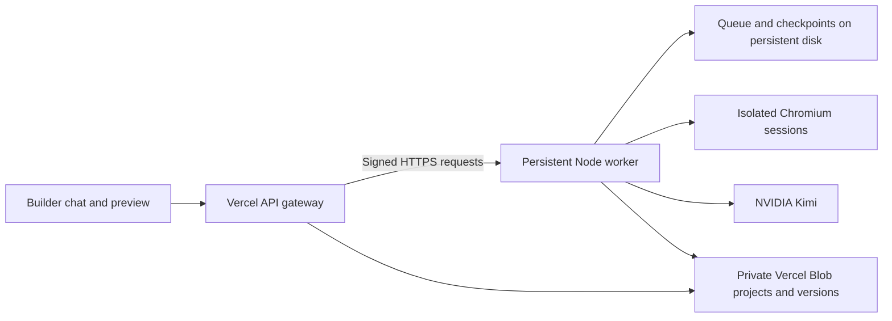

# Hosted browser workflow

Implemented September 6, 2026. The local builder now connects to a separate worker on port 3101. A protected Vercel preview has now been deployed for integration testing. The production site has not been promoted, and no paid worker has been provisioned.

## Architecture



The Vercel API authenticates the workspace and proxies reconstruction, polling, cancellation and comparison images. It never spawns a reconstruction child in a Vercel Function. Only the worker needs model credentials. Gateway and worker must use the same private Blob store and signing secret. The browser never receives the worker secret.

Chat polling reconnects through transient worker/network outages for up to two minutes, without re-submitting the generation request. Queue admission is serialized; existing workspace/global daily quotas still apply. One browser job runs at a time by default, with at most 20 active/queued jobs globally and three per workspace. Retries reuse the existing active request. Job JSON, checkpoints and artifacts use atomic, synced writes on the persistent volume. Saved projects and versions stay in private Blob storage.

The supervisor resumes unfinished jobs after a restart. Checkpoints and completed Kimi responses are reused. A crash after the project version was saved is detected and does not append a duplicate version. Three interrupted attempts pause the job for an explicit retry. An interrupted provider request without a saved response may need to be sent again; exactly-once provider billing is not guaranteed.

Cancellation markers are durable. Queued cancellations do not launch a browser. Running cancellations close the browser and abort model work. On shutdown the parent stops admission, asks children to checkpoint/exit, then terminates stragglers. The process is supervised, and a 60-second disk lease prevents a replacement from racing a recently crashed supervisor. A failed host should be restarted automatically.

## Local use

The existing `.env.local` has been configured privately with a signing secret and `FUSION_WORKER_URL=http://127.0.0.1:3101`. Start both processes from the repository root:

```sh
FUSION_WORKER_HOST=127.0.0.1 PORT=3101 node --env-file=.env.local scripts/worker-server.mjs
npm run dev -- --port 3000 --strictPort
```

Open `http://localhost:3000`. The status API should show `worker: "connected"` and `reconstructionEnabled: true`. Removing `FUSION_WORKER_URL` restores the previous local detached-worker path after restarting Vite. Keep the private signing secret out of frontend `VITE_*` variables.

## Deploying the worker

The container is a Node 24 service with Chromium, fonts, a non-root user, an init process and a health check. It does not contain the frontend, local `.env` files, workspace data or screenshots. Runtime dependencies are installed from the lockfile.

1. Choose a persistent Docker host with enough memory for Chromium. Start with one worker slot and at least 2 GB RAM; larger or image-heavy references can require more. Do not scale this service horizontally: this version uses one queue and one attached volume.
2. Prepare `.env.worker` privately using `.env.example`. Set the same `BLOB_READ_WRITE_TOKEN` used by the Vercel project, a random secret of at least 32 characters, and the existing NVIDIA/Kimi credentials. For Docker set `FUSION_JOB_DIR=/data/jobs`, `FUSION_CHROMIUM_EXECUTABLE_PATH=/usr/bin/chromium`, and `PORT=3101`; omit `FUSION_WORKER_URL` on the worker.
3. Build and check the container, then start it:

```sh
docker compose -f compose.worker.yaml build
docker compose -f compose.worker.yaml run --rm fusion-worker npm run worker:check
docker compose -f compose.worker.yaml up -d
```

The Compose service binds to loopback. Put an HTTPS reverse proxy in front of port 3101, forwarding `/api/builder` and `/healthz`. Preserve query strings, request bodies and signing/Authorization headers. Allow at least 120 seconds for admission/discovery requests. Do not cache responses or log Authorization/signing headers. All private worker operations require a valid signed request; `/healthz` returns only readiness.

The browser uses Chromium sandboxing. The included seccomp profile is from [Playwright v1.63.0](https://github.com/microsoft/playwright/blob/v1.63.0/utils/docker/seccomp_profile.json), with its license in `deploy/PLAYWRIGHT-LICENSE`. The host must permit unprivileged user namespaces. Startup in production runs a preflight that writes/reads/deletes a temporary Blob record, checks the volume and opens a browser. Do not route traffic to a service that fails this preflight. See [Playwright's Docker guidance](https://playwright.dev/docs/docker) for host requirements.

An optional `render.worker.yaml` specifies one Docker web service, a 10 GB disk, health checks, Kimi and disabled automatic deploys. It is a deployment starting point; **the image and Chromium sandbox have not been validated on Render**. Its compute and disk are paid resources. Review them before provisioning. Render does not expose the Compose seccomp setting, so browser compatibility must be verified there or a compatible Docker host chosen. The [Render Blueprint reference](https://render.com/docs/blueprint-spec) describes these settings; [persistent disk documentation](https://render.com/docs/disks) covers lifecycle and backup behavior.

## Connecting Vercel after the worker passes its checks

Set these server-only variables on a Vercel **preview deployment first**:

- `FUSION_WORKER_URL`: the worker's HTTPS origin, without a path.
- `FUSION_WORKER_SECRET`: exactly the same private secret as the worker.
- `BLOB_READ_WRITE_TOKEN`: the same private Blob store as the worker.

Deploy the current gateway code to that preview. Generate a fresh test project, refresh the tab during generation, stop a queued job, and verify its comparison images and final saved version. Promote only after those checks. A preview gateway deployment passed its Vercel build. Production promotion remains separate from the worker setup.

Model credentials remain on the worker. The existing legacy `generate` endpoint is retained for compatibility but is not the hosted reconstruction path. The UI's reconstruction/edit workflow uses the worker. Forms, bookings, payments and other generated-site backends remain outside this frontend-only feature.

## Existing projects and operations

Existing project/version records already in Blob remain available. Comparison screenshots and capture checkpoints from earlier local runs remain on this Mac until explicitly copied to the worker volume. Migrate only after active jobs are stopped; do not copy the supervisor lease or project `.lock` files. For a fresh cloud job, the worker can recapture the reference. No local job data was uploaded automatically.

Back up the persistent volume and monitor disk usage. Artifacts are retained for project comparison and resume; there is no automatic garbage collection yet. Deleting the worker volume loses queue history and comparison captures, but does not delete saved Blob project versions. This is a single-worker MVP, without multi-region failover, tenant billing or horizontal queue replication. Blob project revision checks protect stale generation results; Blob is not a transactional multi-writer database, so avoid editing a project simultaneously from multiple sessions.

## Verification

- `npm run test:worker`: request authentication/tampering/replay, ownership, queue order, capacity behavior, cancellation, restart fencing, repeated-crash limits and idempotent commit recovery.
- `npm run test:worker:integration`: runs the actual API gateway in a separate process with `VERCEL=1`, a separate worker, and real Chrome. It resumes a saved gym edit checkpoint, restarts the worker during validation, checks 1440/768/390 px layouts, verifies progress and image proxying, and confirms exactly one saved version. It uses isolated local test storage and makes no model request.
- `npm run worker:check`: run with the private environment loaded to check real storage, browser and configuration. It does not call the model.

All 73 automated tests passed (57 existing, 15 worker/reconnection tests and one separate-process browser integration test), along with lint and the frontend build. The existing large-chunk build warning remains. The local preflight passed with private Blob, Chrome and configured NVIDIA Kimi. The separate-process integration test passed, including a mid-job restart. Docker and Colima are installed for verification. The Linux ARM64 image built and its production preflight passed with a non-root, sandboxed Chromium process, private Blob storage and a writable named volume at 1 CPU / 2 GB RAM. A fresh gym workflow and the AMD64 image are being checked before cloud provisioning. The remote worker is not yet connected to Vercel.
